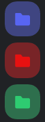

  
  
  
  
  

## Folder Icons
Allows you to make the image of your folder a solid color with a folder icon instead of the 4-Grid of server icons.

*Example of Folder Icons*
> 

### How to Use Folder Icons
To "activate" Folder Icons all you have to do is double click one of your folders in Discord fast.
